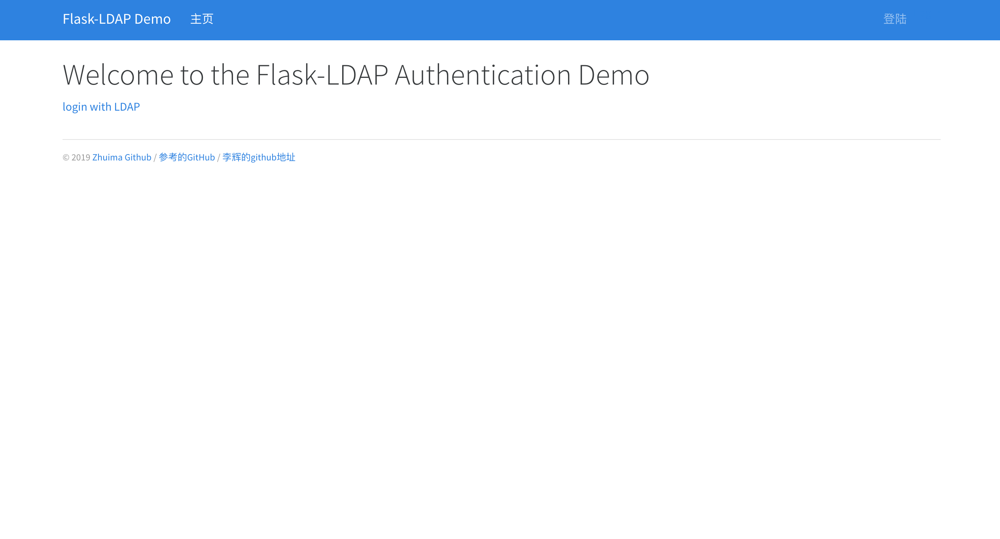
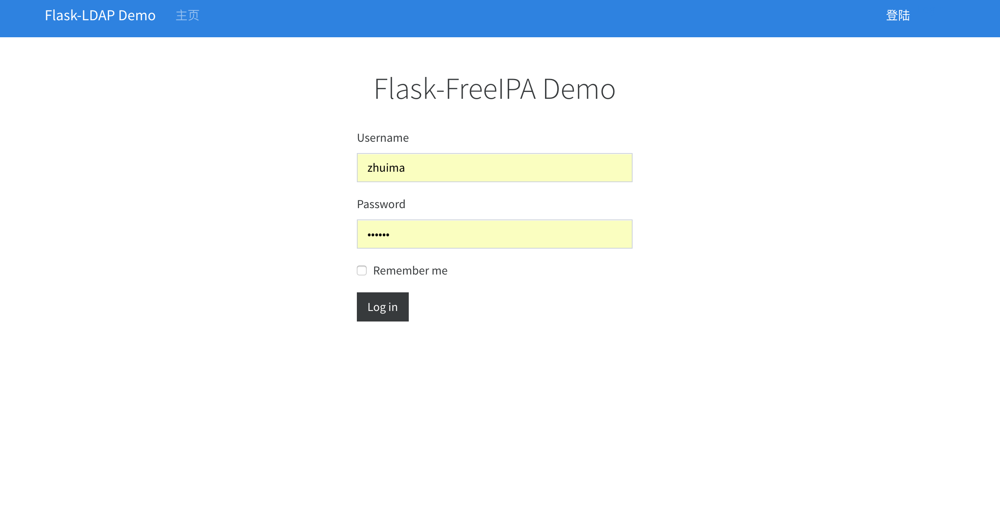

Flask Authentication with FreeIPA(LDAP)
===============================


[TOC]

[](https://www.python.org/)
[](http://flask.pocoo.org/)
[](https://docs.pipenv.org/)


### 一、Installation

```python
$ git clone https://github.com/zhuima/flaskipa.git
$ cd flaskipa
$ pipenv install --dev
$ pipenv shell
$ pipenv run flask run
* Running on http://127.0.0.1:5000/
```


### 二、style

#### 2.1、home




#### 2.2、login



### 三、致谢前辈

[李辉的github](https://github.com/greyli/bluelog)

[demo来源](https://github.com/tutsplus/Flask-LDAP-Auth-Demo)


### 四、Instructor: Shalabh Aggarwal


	Flask is a Python based micro web-framework which allows you to write your web applications quickly and efficiently. LDAP is an Internet Protocol for looking up contact information about users, information about certificates, network pointers, etc from a server where the data is stored in a directory style structure. In this tutorial, I will take you through how to implement authentication of users in your Flask application using LDAP.


Tuts+ tutorial available at: [Flask Authentication with LDAP](http://code.tutsplus.com/tutorials/flask-authentication-with-ldap--cms-23101)
